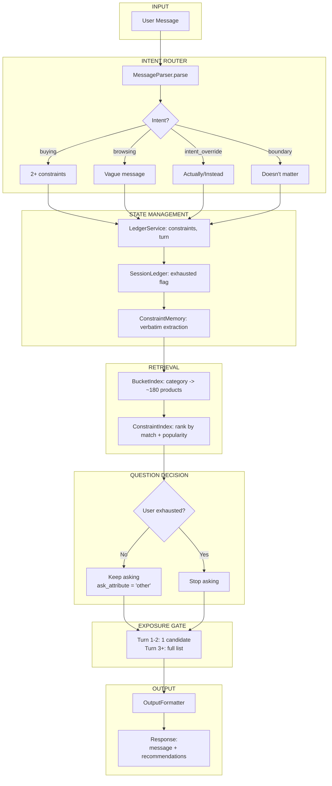
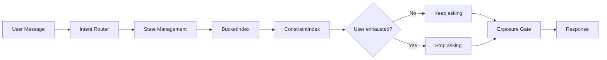
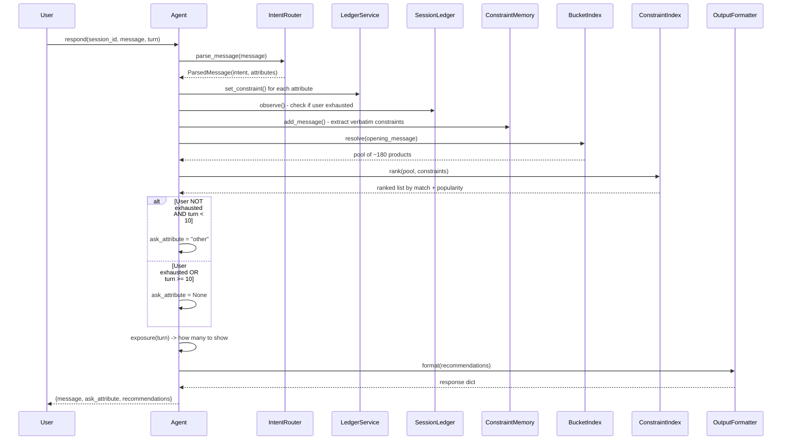

# CONVERSATIONAL SHOPPING AGENT - ARCHITECTURE

## Overview

This document describes the architecture for the TechJam Conversational Shopping Agent. The agent finds a hidden target product by asking smart clarifying questions and searching a 50,000 product catalog within 10 turns.

---

## System Flow

```
User Message
    |
    v
+----------------------+
|    Intent Router     |  <- Detect: buying/browsing/override/boundary
|    (MessageParser)   |  <- Extract attributes from message
+----------------------+
    |
    v
+----------------------+
|   State Management   |
|  - LedgerService     |  <- Store constraints, turn, asked_attributes
|  - SessionLedger     |  <- Track if user is exhausted
|  - ConstraintMemory  |  <- Extract verbatim constraints from templates
+----------------------+
    |
    v
+----------------------+
|      Retrieval       |
|  - BucketIndex       |  <- Category -> ~180 product pool
|  - ConstraintIndex   |  <- Rank by verbatim match + popularity
+----------------------+
    |
    v
+----------------------+
|   Question Decision  |  <- Stop if: user has no more preferences
|                      |  <- Stop if: turn >= 10 (max turns)
|                      |  <- Otherwise: ask_attribute = "other"
+----------------------+
    |
    v
+----------------------+
|    Exposure Gate     |  <- Turn 1-2: show 1 candidate
|                      |  <- Turn 3+: show full list
+----------------------+
    |
    v
+----------------------+
|   Output Formatter   |  <- Build response message
+----------------------+
    |
    v
Response: {message, ask_attribute, recommendations, usage}
```

---

## Main Architecture Diagram



---

## Simplified Flow



---

## Sequence Diagram



---

## Component Descriptions

### 1. Intent Router (`src/intent_router`)
Parses user message to detect intent and extract attributes.

| Intent | Signal | Example |
|--------|--------|---------|
| buying | 2+ constraints | "I need black running shoes size 10" |
| browsing | Vague message | "I want something comfortable" |
| intent_override | "Actually/Instead" | "Actually, I need boots instead" |
| boundary | "Doesn't matter" | "I don't have a preference for color" |

### 2. ConstraintMemory (`src/intent_router/constraint_memory`)
Extracts **verbatim** constraint strings from evaluator templates:
- `"A key requirement is: {c}"`
- `"For that, what matters is: {c1}; {c2}"`
- `"What I need is: {c}"`

Applies **evict-on-value-conflict**: if user says "cotton" then later "leather", evict "cotton".

### 3. BucketIndex (`src/retrieval/buckets`)
Maps opening message category to a product bucket.

**How it works:**
1. Parse category from opening: `"I'm looking for Women Dresses"` -> `"Women Dresses"`
2. Resolve to bucket key via exact match, containment, or token overlap
3. Return pool of ~180 products (vs 50k whole catalog)

### 4. ConstraintIndex (`src/retrieval/constraint_index`)
Scores products by **verbatim constraint matching**.

**Scoring tiers:**
- Exact match (3.0): constraint string in product's attributes
- Substring (1.0): constraint in product's searchable text  
- Token match (0.5): all constraint tokens appear in text

**Final ranking:** constraint_score desc, then popularity desc

### 5. Question Decision (`src/confidence/policy.py`)
Decides whether to keep asking clarifying questions.

**Stop asking when:**
- User says "I don't have an additional preference" (exhausted)
- OR turn >= 10 (max turns reached)

**Otherwise:** Keep asking with `ask_attribute = "other"`

```python
# src/confidence/policy.py
FIXED_ASK_ATTRIBUTE = "other"
TURN_CUTOFF = 10

def always_ask(ledger: SessionLedger) -> ConfidencePayload:
    clarify = not ledger.exhausted and ledger.turn < TURN_CUTOFF
    return ConfidencePayload(
        clarify=clarify,
        ask_attribute=FIXED_ASK_ATTRIBUTE if clarify else None,
    )
```

**Why "other"?** The evaluator treats `"other"` as a wildcard that reveals ANY undisclosed constraint (up to 2 per turn). This gets more information than asking for specific attributes.

### 6. Exposure Gate (`src/confidence/policy`)
Controls how many recommendations to show.

| Condition | Reveal |
|-----------|--------|
| Turn 1-2 | 1 candidate |
| Turn 3+ | Full list (10) |
| User exhausted | Full list (10) |
| Turn 10 (final) | Full list (10) |

---

## Data Flow Example

```
Turn 1: "I'm looking for Women Dresses. A key requirement is: cotton."

1. INTENT ROUTER:
   intent: 'buying'
   attributes: {category: 'Women Dresses', material: 'cotton'}

2. CONSTRAINT MEMORY:
   verbatim_constraints: ['cotton']

3. BUCKET INDEX:
   resolve("Women Dresses") -> pool of 245 products

4. CONSTRAINT INDEX:
   rank(pool, ['cotton']) -> products with 'cotton' in features score higher
   -> return top 10 ranked by match + popularity

5. QUESTION DECISION:
   user_exhausted = False, turn = 1
   -> keep asking, ask_attribute = "other"

6. EXPOSURE GATE:
   turn = 1 -> show 1 candidate

7. OUTPUT:
   message: "What other details matter? (color, size, style...)"
   ask_attribute: "other"
   recommendations: [{'parent_asin': 'B001...'}]
```

---

## API Contract

### reset(session_id, user_profile)
```python
user_profile = {
    'preference_tags': ['fit', 'comfort'],
    'rating_style': 'usually positive',
}
```

### respond(session_id, message, turn, top_k) -> dict
```python
{
    'message': str,              # Follow-up question or recommendation intro
    'ask_attribute': str | None, # "other" while asking, None when done
    'recommendations': [{'parent_asin': '...'}, ...],
    'usage': {'prompt_tokens': 0, 'completion_tokens': 0}
}
```

---

## File Structure

```
src/
├── agent.py                    # Main orchestrator
├── intent_router/
│   ├── router.py               # parse_message, detect_scenario
│   └── constraint_memory.py    # Verbatim constraint extraction
├── ledger/
│   └── ledger.py               # LedgerService (session state)
├── retrieval/
│   ├── buckets.py              # BucketIndex (category -> product pool)
│   └── constraint_index.py     # ConstraintIndex (verbatim scoring)
├── reranker/
│   └── rank.py                 # Reranker.rank_bucket()
├── confidence/
│   ├── policy.py               # Question decision, exposure gate
│   ├── session_ledger.py       # SessionLedger (exhausted flag)
│   └── fallback.py             # safe_decide wrapper
└── output/
    └── formatter.py            # OutputFormatter
```
